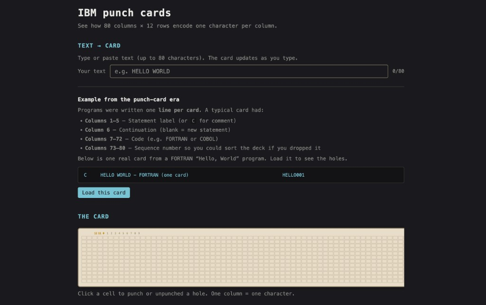

# IBM Punch Card — Learn how they work

A small web app to understand **IBM (Hollerith) 80-column punch cards**: how 80 columns × 12 rows encode one character per column, and how to read or “punch” a card yourself.

## How to run

Open `index.html` in a browser (double-click or use your editor’s “Open with Live Server”). No build step required.

## What you can do

- **Start tutorial** — Step-by-step guide: one column at a time, digits, zones, letters (A–I, J–R, S–Z), then decode a column. Finish with the full 80-column card.
- **Text → Card** — Type or paste text (up to 80 characters). The card updates in real time so you see which holes represent each character.
- **Card → Text** — Click any cell on the card to punch or unpunch a hole. The “Column → Character” section shows the decoded character and punch code (e.g. `12-1` for “A”).
- **Example from the punch-card era** — Load a real FORTRAN “Hello, World” comment card to see how columns 1–5 (label), 7–72 (code), and 73–80 (sequence number) were used.
- **How it works** — Short explanation of the 80×12 layout, zone vs digit rows, and how letters, digits, and symbols are encoded.
